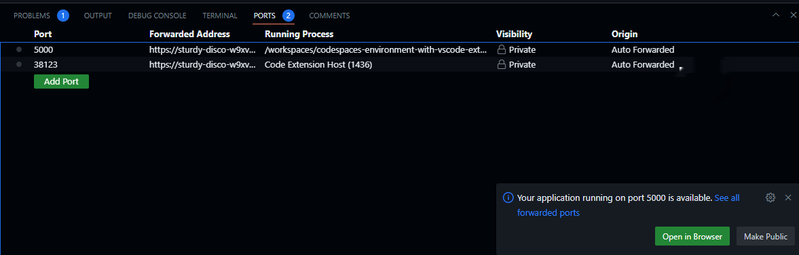

# Running a python flask app

## Preparation

In VScode's terminal, create the folder `flask-hello`to complete the following tasks.

```
mkdir flask-hello
cd flask-hello
```

## Create and run a Python flask app

Python Flask is a web framework for Python which provides functionality for building web applications. You can build websites or REST API easily with Python flask. Visit [https://stackshare.io/flask](https://stackshare.io/flask) to know more about the companies who are using Python Flask

In this tutorial, you will learn how to create a REST API using python flask.&#x20;

First, check the version of python in the host.

```
python --version
```

What is the version of Python in the Docker host within your workspace?


Inside the `flask-hello` folder, create a python script `app.py` as follows.

```python
import os
import socket
from flask import Flask,request,jsonify

app = Flask(__name__)

@app.route("/")
def main():
    return "Welcome Python flask!"

@app.route('/about')
def about():
    return 'I am '+socket.gethostname()

@app.route('/users')
def get_users():
    json_data = [{"name":"alice","age":18},{"name":"bob", "age": 22}]
    return jsonify(json_data),200

if __name__ == "__main__":
    app.run(host="0.0.0.0", port=5000, debug=True, use_reloader=True)   
```

The above script creates a python flask app with three endpoints.
- `/` endpoint returns a string `Welcome Python flask!`
- `/about` endpoint returns the hostname of the container
- `/users` endpoint returns a JSON object with two users alice and bob

Save the file (**Ctrl+S**).

To run the python flask app, execute in the VSCode's terminal

```
python app.py
```


You may encounter the following error. Why?

<div align="left">


</div>


We first initiate a Python virtual environment to install the python flask dependency for executing the app.&#x20;

Execute in the terminal the following command.

```
virtualenv venv
```

> If your system does have virtualenv installed, you can install it by using the pip tool.
>
> ```
> pip install virtualenv 
> ```

A folder named `venv` will be created for storing the libraries installed in the virtual environment.

<div align="left">


</div>

To activate the virtual environment, execute

```
source venv/bin/activate
```

<div align="left">


</div>


The shortcut for the above command is&#x20;

```
. venv/bin/activate
```


To install flask the Python virtual environment, execute

```
pip install flask
```

After installing the Python flask package, check the installed Python libraries with the command `pip freeze`.

```
pip freeze
```

<div align="left">


</div>


To exit the virtual environment, execute

```
deactivate
```


Now, re-run the python flask app. Execute in the VSCode's terminal

```
python app.py
```

The application will listen at `http://localhost:5000`. 

Sample output:


The python flask app has started up a web application at `http://localhost:5000`. If you are running this application using your own machine, you can access the application by navigating to this URL using your browser.

In GitHub Codespaces, you can navigate to the application by the URL mapped to the port 5000 at localhost.

</div align="left">

<figure><figcaption></figcaption></figure>

</div>

In the browser, navigates to the `/` and `/about` and `/users` endpoint.


Sample output for the`/users` endpoint.

<div align="left">


</div>


In the terminal running the python flask, press `Ctrl+C` to stop your Flask Apps.


To exit the Python virtual environment, execute

```
deactivate
```


Re-run the python flask app.&#x20;

```
python app.py
```

Can you execute the app?&#x20;


# Commit your work and push the changes to the remote repository

Create a new branch "task1" and commit your changes. Push the changes to the remote repository.

```bash
git checkout -b task1
git add .
git commit -m "Create a python flask app"
git push origin task1
```

