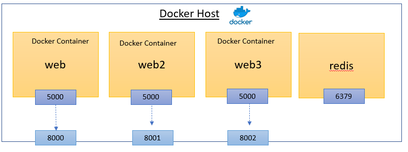

# Docker Compose

## Overview 
Docker compose is a tool for defining and running multi-container Docker applications. With Compose, you use a YAML file to configure your application's services, networks, and volumes. Then, with a single command, you create and start all the services from your configuration.

In this tutorial, you'll learn how to use Docker Compose to manage a multi-service Python web application. 
- The application uses the Flask framework and Redis for a hit counter. 
- Redis is an open-source, in-memory no-sql databases that can be used as a database, cache, and message broker.
- You'll create a basic Python web application and use Docker Compose to build and run the application.


## Set Up

1. **Create a Project Directory:**

   ```bash
   mkdir composetest
   cd composetest
   ```

2. **Create `app.py`:**

   In your project directory, create a file named `app.py` and paste the following code:

   ```python
    import time
    import redis
    from flask import Flask

    app = Flask(__name__)
    cache = redis.Redis(host='redis', port=6379)

    def get_hit_count():
        retries = 5
        while True:
            try:
                return cache.incr('hits') 
            except redis.exceptions.ConnectionError as exc:
                if retries == 0:
                    raise exc
                retries -= 1
                time.sleep(0.5)

    @app.route('/')
    def hello():
        # print the hostname and IP address of the container
        import socket
        hostname = socket.gethostname()
        ip_address = socket.gethostbyname(hostname)
        count = get_hit_count()

        return_msg = (
            f"Hostname: {hostname}<br/>"
            f"IP Address: {ip_address}<br/>"
            f"Hello World! I have been seen {count} times.<br/>"
        )
        return return_msg

    if __name__ == "__main__":
        app.run(host="0.0.0.0", port=5000)
   ```

   **Explanation:**

   - `redis` is the hostname of the Redis container on the application's network.
   - The default port `6379` is used for Redis.
   - Redis provides various data structures, including strings, hashes, lists, sets, and sorted sets for storing data. In the above example, 'hits' is the key Redis string used to store the hit count in Redis.
   

   **Note:**  
   The `get_hit_count` function includes a retry mechanism. This basic loop attempts the request multiple times if the Redis service is unavailable, enhancing the application's resilience during startup and unexpected Redis restarts.

3. **Create `requirements.txt`:**

   In your project directory, create a file named `requirements.txt` and add:

   ```
   flask
   redis
   ```

4. **Create a `Dockerfile`:**

   Create a file named `Dockerfile` (ensure it has no file extension like `.txt`) in your project directory and paste the following:

   ```dockerfile
    FROM python:3.10-slim
    WORKDIR /code
    COPY requirements.txt requirements.txt
    RUN pip install -r requirements.txt
    COPY . .
    CMD ["python", "app.py"]
   ```

    Here's a breakdown of the Dockerfile:
    - FROM: Specifies the base image to use for the container.
    - WORKDIR: Sets the working directory inside the container.
    - COPY: Copies the `requirements.txt` file to the container.
    - RUN: Installs the Python dependencies listed in `requirements.txt`.
    - EXPOSE: Exposes port 80 to allow external connections.
    - COPY: Copies the project files into the container. The first `.` refers to the current directory on the host machine, and the second `.` refers to the working directory inside the container.
    - CMD: Specifies the command to run when the container starts.
  
   For more details on writing Dockerfiles, refer to the [Dockerfile Reference](https://docs.docker.com/engine/reference/builder/).

## Define Services in a Compose File

Docker Compose simplifies the management of your entire application stack by allowing you to define services, networks, and volumes in a single YAML configuration file.

1. **Create `docker-compose.yaml`:**

   In your project directory, create a file named `docker-compose.yaml` and add the following:

   ```yaml
   services:
     web:
       build: .
       ports:
         - "8000:5000"      
     redis:
       image: "redis:alpine"
       container_name: redis_container
       volumes:
         - ./redis_data:/data
   ```

   **Explanation:**

   - **web Service:**
     - **Build:** Uses the Dockerfile in the current directory to build the image.
     - **Ports:** Binds port `8000` on the host to port `5000` in the container.
   
   - **redis Service:**
     - **Image:** Uses the official Redis image (`redis:alpine`) from Docker Hub.


##  Build and Run Your App with Compose

With Docker Compose, you can create and start all the services defined in your configuration file with a single command.

1. **Start the Application:**

   From your project directory, run:

   ```bash
   docker compose up
   ```

2. **Access the Application:**
    In GitHub codespaces, navigate to the URL mapped to localhost port 5000. In your local machine, navigate to [http://localhost:8000/](http://localhost:8000/).

   Sample output:

   ```
    Hostname: 8d3c4f32f076
    IP Address: 172.21.0.3
    Hello World! I have been seen 1 times.
   ```

3. **Interact with the Application:**

   - **Refresh the Page:** The hit counter should increment with each refresh.

     ```
     Hello World! I have been seen 2 times.
     ```

4. **List Docker Images:**

   Open another terminal window and run:

   ```bash
   docker image ls
   ```

5. **Show Running Containers:**

   In a new terminal window, run:

   ```bash
   docker ps
   ```

6. Examining the redis container:

   - **Access the Redis CLI:** Run `docker exec -it redis_container redis-cli` to access the Redis CLI.
   - **Check the Hit Count:** Run `get hits` to view the current hit count. 
   - **Exit the CLI:** Type `exit` to leave the Redis CLI.

7. **Stop the Application:**

   - **Option 1:** Run `docker compose down` in your project directory.
   - **Option 2:** Press `CTRL+C` in the terminal where you started the app.


## Persistence by Using Bind-Mount and Volume


Ensuring data persistence is crucial for applications that rely on data storage. Docker Compose provides mechanisms like bind mounts and volumes to persist data beyond the lifecycle of containers.

### Bind Mount
Bind mounts map a directory on the host machine to a directory in the container. Changes to the files in the host directory are immediately reflected in the container and vice versa.

**The `docker-compose.yaml` we have created is using a bind Mount:**

   ```yaml
   services:
     redis:
       image: "redis:alpine"
       volumes:
         - ./redis_data:/data
   ```

   **Explanation:**

   - **Bind Mount:** Maps the `./redis_data` directory on the host to `/data` in the Redis container.
   - **Advantages:** Facilitates direct access to data files from the host, useful for debugging or backup purposes.

### Volume
Volumes are managed by Docker and provide a more robust solution for data persistence. They are stored in a part of the host filesystem that is managed by Docker (`/var/lib/docker/volumes/` on Linux).

The following `docker-compose.yaml` uses a volume for Redis:

   ```yaml
   services:
     redis:
       image: "redis:alpine"
       volumes:
         - redis-data:/data

   volumes:
     redis-data:
   ```

   **Explanation:**

   - **Volumes:** Maps a Docker-managed volume named `redis-data` to the `/data` directory inside the Redis container.
   - **Persistent Storage:** Data stored in `redis-data` persists even if the Redis container is removed or recreated.


## Experiment with Other Commands

Explore additional Docker Compose commands to manage your services effectively.

1. **Run Services in Detached Mode:**

   To run your services in the background, use the `-d` flag:

   ```bash
   docker compose up -d
   ```

   **Output Example:**

   ```
   Starting composetest_redis_1...
   Starting composetest_web_1...
   ```

2. **List Running Containers:**

   View currently running services with:

   ```bash
   docker-compose ps
   ```


3. **View Help:**

   To see other available commands, execute:

   ```bash
   docker-compose --help
   ```

4. **Stop Services:**

   - **Option 1:** Stop services without removing containers:

     ```bash
     docker compose stop
     ```

   - **Option 2:** Remove containers entirely:

     ```bash
     docker compose down
     ```
   - **Option 3:** Remove containers, network and volumes. This is useful when you want to completely clean up your Docker environment.

     ```bash
     docker compose down -v
     ```


## Launch Multiple Instances of the App

Scaling your application to handle increased load or to ensure high availability involves running multiple instances (replicas) of your services.


Modify the `docker-compose` service to run three instances of the Flask app:

**`docker-compose.yaml`:**

```yaml
services:
   web:
      build: .
      ports:
      - "8000:5000"      
   web2:
      build: .
      ports:
      - "8001:5000"      
   web3:
      build: .
      ports:
      - "8002:5000"      
   redis:
      image: "redis:alpine"
      container_name: redis_container
      volumes:
      - ./redis_data:/data
```



Re-start  your docker-compose services:

```bash
docker compose up
```

Access the application at [http://localhost:8000/](http://localhost:8000/), [http://localhost:8001/](http://localhost:8001/), and [http://localhost:8002/](http://localhost:8002/).

**Note:**  
Each instance of the Flask app will have a unique hostname and IP address. Refresh the page to see the hit counter increment across different instances.

# Commit your work and push the changes to the remote repository

Create a new branch "task3" and commit your changes. Push the changes to the remote repository.

```bash
git checkout -b task3
git add .
git commit -m "Docker Compose for multi-service Python web application"
git push origin task3
```
