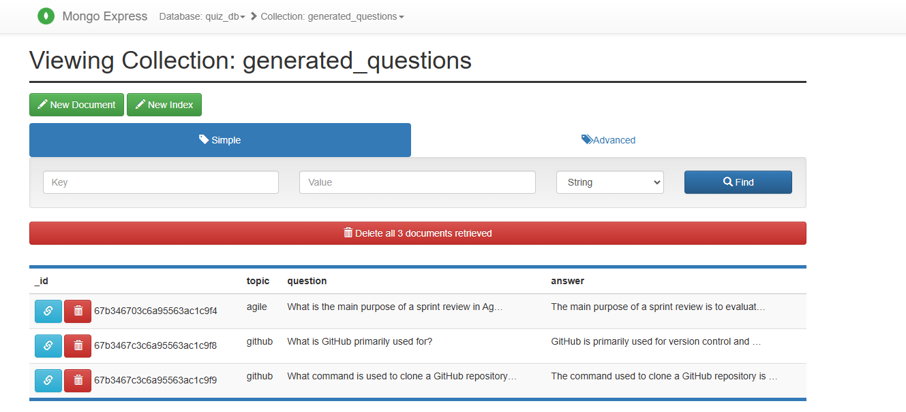

Complete the tasks for the GenAI Powered Quiz App we have developed in the previous lab.

**Task 1: Dockerize the App and Run It with Streamlit**
  - Change the "llm.py" to  read the API key from the environment variable `GITHUB_API_KEY` instead of the credential file.
  - Set your GitHub API key as an environment variable.
  - Install dependencies, set up a virtual environment, and run the `llm.py` script.
  - Test the app locally by running the Streamlit app.
  - Create and configure a Dockerfile for the app. Build the Docker image.
  - Run the app in Docker container with the appropriate environment variables and test your app.

**Task 2: Connect Your App to MongoDB to Store Generated Questions**
  - **Part A:**  
    - Run a MongoDB using Docker.
    - Update the app's code to store the generated questions in MongoDB.
    - Launch the Streamlit app and generate questions.
    - Verify that the questions are stored in MongoDB using container commands and the MongoDB shell.
    - Stop the MongoDB container.
    
  - **Part B:**  
    - Create a Docker network for inter-container communication between the app and MongoDB.
    - Start the MongoDB container on the created network.
    - Update the app's URI to target MongoDB by its container name.
    - Build and run the app container within the same Docker network.
    - Generate questions and verify they are saved in the database. You may launch a shell in the MongoDB container to verify that the data is stored in the database.

**Task 3: Create a Docker-Compose File to Run the App, MongoDB, and Mongo Express**
  - Create a `docker-compose.yaml` file that defines services for the app, MongoDB, and Mongo Express.
  - Include environment variables (optionally using a `.env` file) for the GitHub API key and MongoDB credentials.
  - Run the docker-compose stack (with or without the rebuild flag).
  - Test the Streamlit app and verify that generated questions appear in the Mongo Express dashboard.

